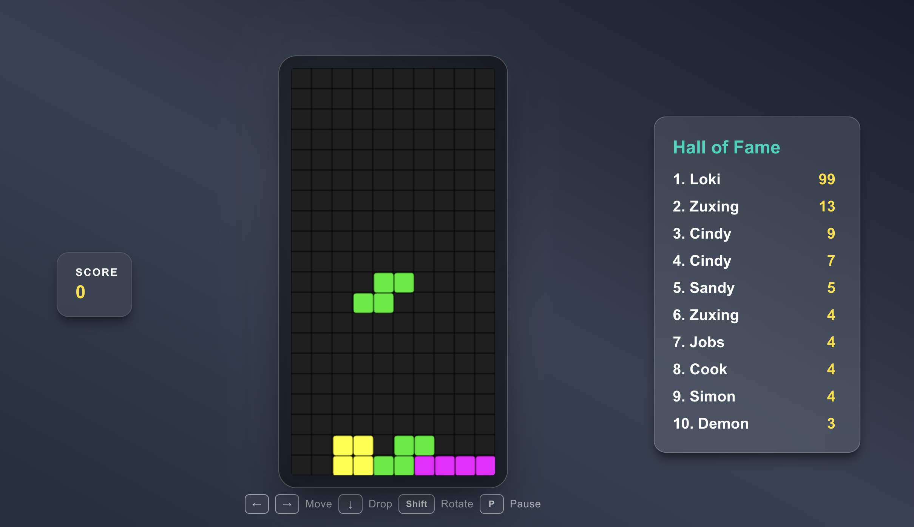

# Tetris Web

**This is a [Tetris](https://en.wikipedia.org/wiki/Tetris) game built with React and TypeScript, designed to be played in a web browser. The game features classic Tetris gameplay, including piece rotation, line clearing, score ranking, and 6 special clear effects. Players can compete for high scores and enjoy a nostalgic gaming experience.**

**Live Demo**: https://tetris-web-zuxing.vercel.app

## Features
1. Classic Tetris gameplay with piece rotation and line clearing.
2. Current score display to keep track of your points on the go.
3. Top 10 score ranking to compete with other players.
4. 6 special clear effects (heart, bird, cloud, bubble, smoke, particle) for visual excitement.

## Frameworks and Libraries
- React: A JavaScript library for building user interfaces.
- Canvas: Used for rendering the game board and pieces.
- Supabase: A backend-as-a-service platform that provides a PostgreSQL database and authentication services. User scores are stored in the Supabase database, allowing for persistent score saving and ranking.
